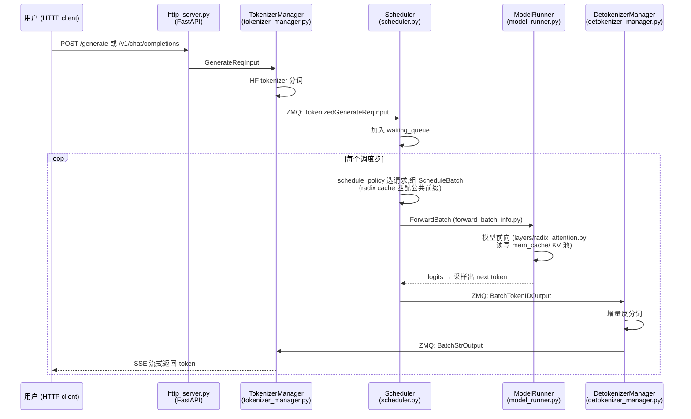

# 实验 5:走读一条请求的代码链路(约 2 小时,读代码为主)

## 目标

按请求生命周期顺序精读 SRT 关键代码,画出一条请求从 HTTP 进入到流式返回的完整时序图。

## 请求流转总览

## 精读清单(按顺序)

1. **`python/sglang/srt/entrypoints/http_server.py`** — 请求进入
   - 找到 `/generate` 路由处理函数,看它如何把请求交给 `TokenizerManager`。
2. **`python/sglang/srt/managers/tokenizer_manager.py`** — 分词与 ZMQ 分发
   - `generate_request()`:分词、构造 `TokenizedGenerateReqInput`、通过 ZMQ socket 发送;
   - 留意它如何用 `rid`(request id)关联异步返回结果。
3. **`python/sglang/srt/managers/scheduler.py` + `schedule_batch.py`** — 组 batch
   - `Scheduler` 的主事件循环:收请求 → `get_next_batch_to_run()` → 跑 batch → 处理结果;
   - `schedule_batch.py` 中的 `Req`(单请求状态)与 `ScheduleBatch`(一批请求);
   - `prepare_for_extend()` / `prepare_for_decode()`:prefill 与 decode 两种 batch 的准备。
4. **`python/sglang/srt/model_executor/model_runner.py` + `forward_batch_info.py`** — GPU 前向
   - `ForwardBatch`:调度层数据结构转成 GPU 张量(input_ids、positions、KV 索引);
   - `forward()` 中 extend / decode 两条路径,以及 CUDA Graph 重放。
5. **`python/sglang/srt/layers/radix_attention.py` + `mem_cache/`** — 注意力与 KV 缓存
   - `RadixAttention.forward()` 如何调用注意力后端并写入 KV 池;
   - `mem_cache/radix_cache.py`:radix tree 的 `match_prefix` / `insert` / 驱逐。
6. **`python/sglang/srt/managers/detokenizer_manager.py`** — 反分词返回
   - 增量反分词(为什么不能每个 token 独立 decode?想想 BPE 合并)。

进程间消息结构统一定义在 `python/sglang/srt/managers/io_struct.py`。

## 辅助手段

- 在关键函数加 `logger.info(f"[trace] ...")` 打点,发一条请求追踪全链路;
- 或以 `--log-level debug` 启动服务器观察详细日志;
- 用 `py-spy dump --pid <scheduler_pid>` 查看调度进程的实时调用栈。

## 产出

- 一张标注了文件/类名的请求流转时序图(可基于上面的 mermaid 图补充你追踪到的函数名)。

## 思考题

1. 为什么分词(TokenizerManager)和反分词(DetokenizerManager)要放在独立进程,而不是在 Scheduler 进程里做?
2. 一条请求的 `rid` 在整个链路中扮演什么角色?
3. Scheduler 与 ModelRunner 之间为什么不需要 ZMQ?(提示:它们在同一进程)
